# REVOFUN GAMING PLATFORM

--- 

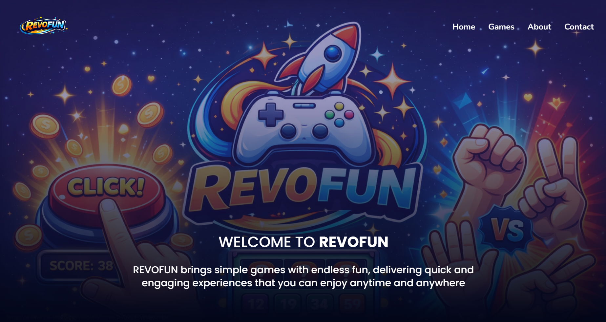
🔗 [View Live REVOFUN Gaming Platform](https://revou-fsse-feb26.github.io/milestone-2-Arzy4-1/)

---

## OVERVIEW

REVOFUN is a **casual gaming platform that offers simple yet entertaining games** designed to deliver quick and enjoyable experiences. Whether you have a few minutes or just want to relax, REVOFUN makes it easy to have fun anytime, anywhere.

The website is thoughtfully **structured into multiple pages**, including a Landing Page for introduction also overview of the games, a Gaming Page featuring interactive mini-games such as Clicker, Number Guessing, and Rock Paper Scissors, an About Page explaining the platform’s purpose, and a Contact Page for connection and feedback. Each game is built to challenge different aspects of the player, including reflexes, logic, and decision-making.

Built using modern web technologies, **REVOFUN focuses on clean design, responsive layout, and smooth user interaction** to ensure an engaging experience across different devices. This platform represents both a creative project and a demonstration of interactive web development skills.

---

## GAMES INSTRUCTIONS
### Click To Win

A fast-paced clicker game designed to test your speed and reflexes. The objective is simple—click as many times as possible within the time limit.

#### How to Play
1. Click the **Start** button to begin the game.  
2. After count down ends, the game start and the button will be clickable.  
3. Click the button as quickly as possible.  
4. Each click increases your score by **1 point**.  
5. The game ends when the timer reaches zero.  
6. Your final score will be displayed at the end.

#### Objective
- Achieve the **highest number of clicks** within the limited time and try to beat your previous highscore.

 

### Guess My Number

A logic-based game that challenges your ability to analyze hints and make accurate decisions under time pressure.

#### How to Play
1. Click the **Start** button to begin the game
2. After count down ends, the game start and user can enter the number.
2. A random number between **1 and 100** will be generated.  
3. Enter your guess in the input field and click **Guess This Number** button.  
4. After each attempt, the game will provide feedback:
    - **Too High** → your guess is above the correct number  
    - **Too Low** → your guess is below the correct number
    - **Close! Lower!** → your guess is near above the correct number   
    - **Close! Higher!** → your guess is near below the correct number 
5. Continue guessing based on the hints provided.  
6. The game ends when you correctly guess the number or the **30-second timer** runs out.

#### Objective
- Find the correct number **as quickly as possible** by using the hints efficiently and minimizing incorrect guesses.

 

### Rock Paper Scissors

A classic decision-making game where you compete against the computer by choosing the best move each round.

#### How to Play
1. Click the **Start** button to begin the game.  
2. Choose one of the available options:
    - **Rock**
    - **Paper**
    - **Scissors**  
3. The computer will randomly select its choice.  
4. The result of each round will be determined based on the rules:
    - **Rock beats Scissors**  
    - **Scissors beats Paper**  
    - **Paper beats Rock**  
5. The scoreboard will update after each round, tracking:
    - Wins  
    - Losses  
    - Draws  

#### Objective
- Win as many rounds as possible against the computer by making the right decisions each time.

---

## KEY FEATURES

**REVOFUN is designed to deliver simple and engaging casual games** that not only help relieve stress but also provide meaningful challenges for players. Each game is carefully crafted to offer a balance between relaxation and mental stimulation, allowing users to enjoy quick moments of entertainment while still engaging their reflexes, logic, and decision-making skills.

Beyond just entertainment, **REVOFUN aims to create an enjoyable and satisfying user experience** through smooth animations, interactive gameplay, and immediate feedback. It is built for those who want to take a short break, reduce stress, and still feel challenged in a fun and engaging way—anytime and anywhere.

There are several types of features implemented in this platform, such as:

1. **Accessible Gameplay**. Each game is **easy to understand and play**, allowing user to jump straight to the game without complex instructions
2. **Simple yet Challenging**. Despite their simplicity, the games **challenge players’ reflexes, logic, and decision-making skills**.
3. **Multiple Mini-Games**. Includes a **variety of games such as Clicker, Number Guessing, and Rock Paper Scissors**, each offering a unique gameplay experience.

---

## TOOLS AND TECHNOLOGIES

The development of this gaming platform involved the use of several tools and technologies to **ensure a clean structure, smooth user experience, and interactive**. Each element was carefully built and styled to create a professional yet welcoming interface, reflecting both technical learning and creative exploration throughout the process.

1. **Tools**
    - Visual Studio Code (VS Code): Use as Code Editor for **writing and editing the programming language** such as HTML, CSS, and Javascript.
    - Opera GX: Web Browser use for **previewing and testing website** during development.
    - GitHub: A platform used to **store, manage, and share** the project repository online.

2. **Technologies**
    - HTML: Utilized to **build a well-structured and semantic foundation** for the gaming platform, ensuring clarity, accessibility, and maintainability.
    - Tailwind CSS: **Applied as the primary styling framework** to rapidly develop a consistent user interface using a utility-first approach.
    - Vanilla CSS: Used to handle advanced styling requirements, including nested element customization and the **implementation of complex animations and visual effects**.
    - JavaScript: Implemented to **develop core game logic, manage user interactions, and control dynamic behaviors across the platform**, enabling an interactive and engaging user experience.

---

## HOW TO DEPLOY AND ACCESS THE PLATFORM

### Deployment

This website is deployed using GitHub Pages by following these steps:

1. Navigate to your repository on GitHub
2. Open "Settings"
3. Go to "Pages" section
4. Under "Source", select "Deploy from branch"
5. Choose main branch and root directory
6. Click save

After a few minutes, GitHub Pages will automatically build and publish the website. A live URL will be generated and displayed at the top of the Pages settings.

### Live Website

My Personal Portfolio Website is now live and can be accessed through the link below:

`https://revou-fsse-feb26.github.io/milestone-1-Arzy4/`

Once opened, users can navigate through the main sections of the website:

- **Home** – Introduction for visitors
- **About** – Information about my background and journey
- **Projects** – A showcase of projects I have worked on
- **Contact** – A form and links to reach me through various platforms

--- 

## PLATFORM'S SCREENSHOT
### Home Page

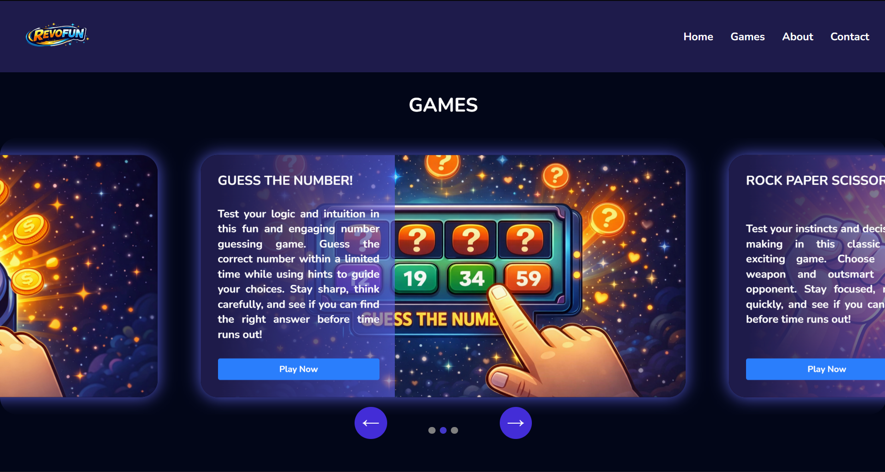
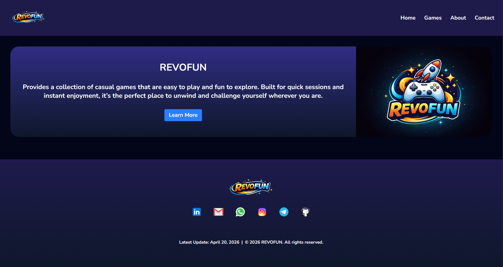

### Clicker Game Page
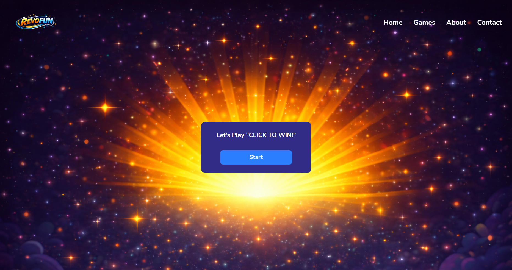
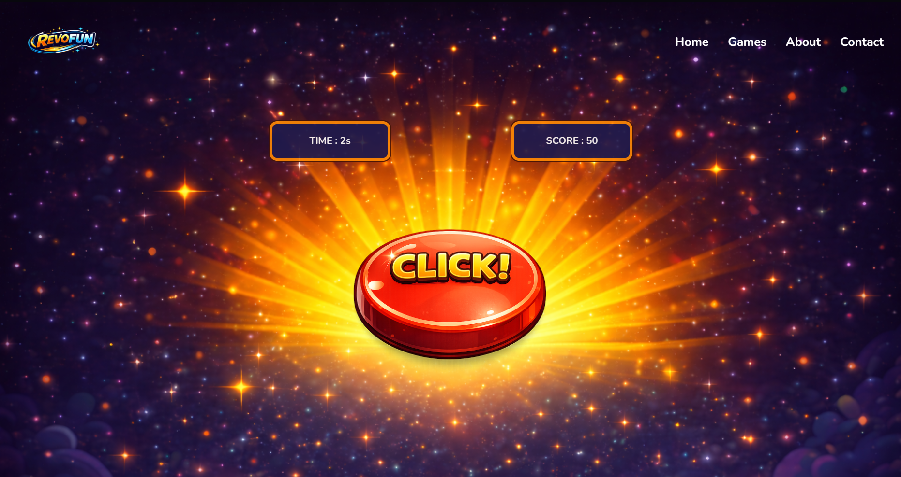
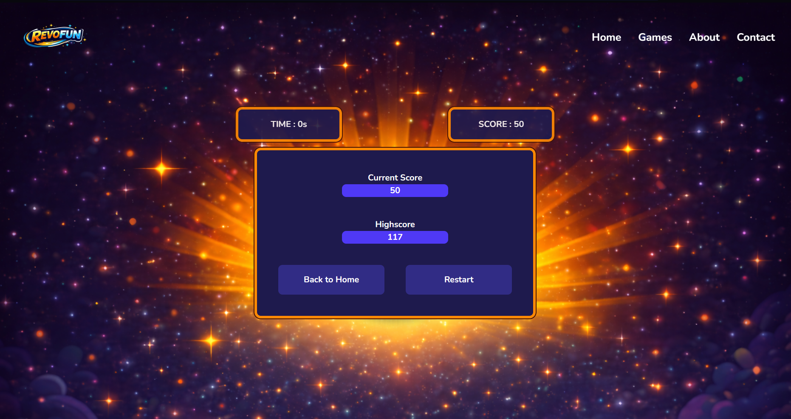

### Number Guessing Game Page
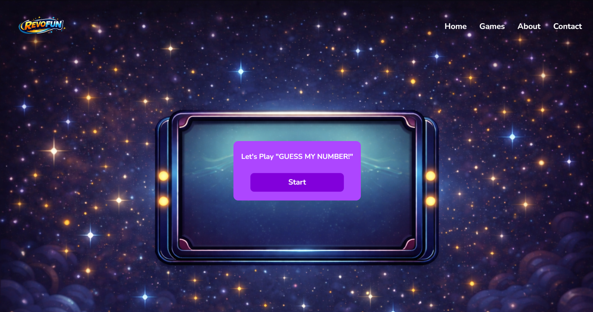
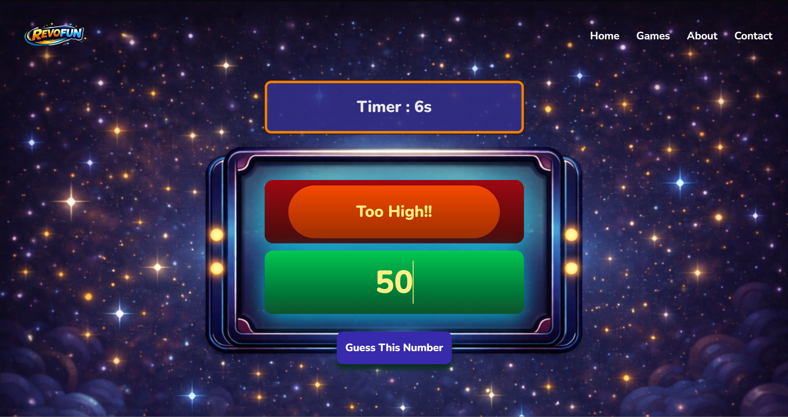
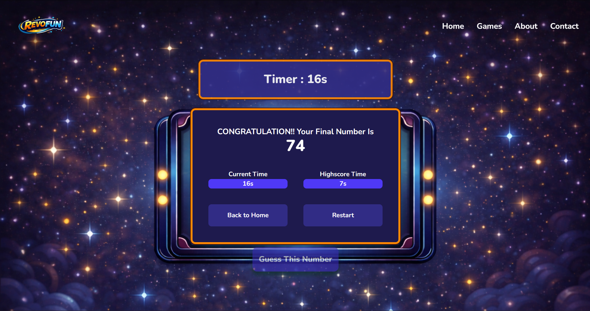

### Rock Paper Scissor Game Page
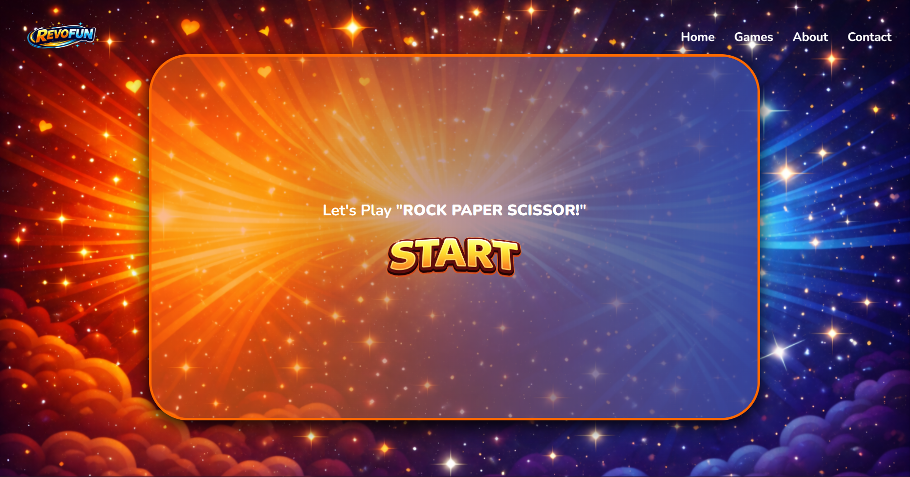
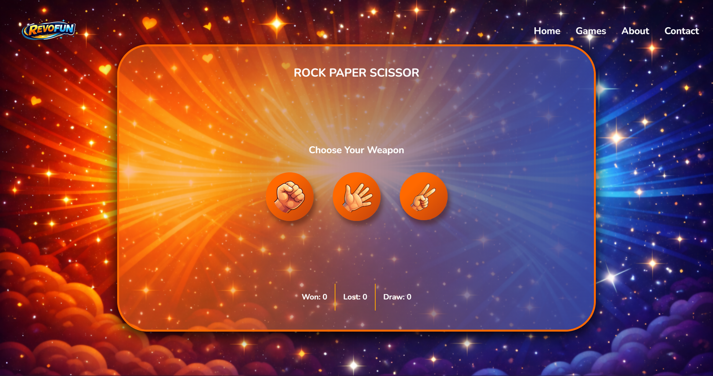
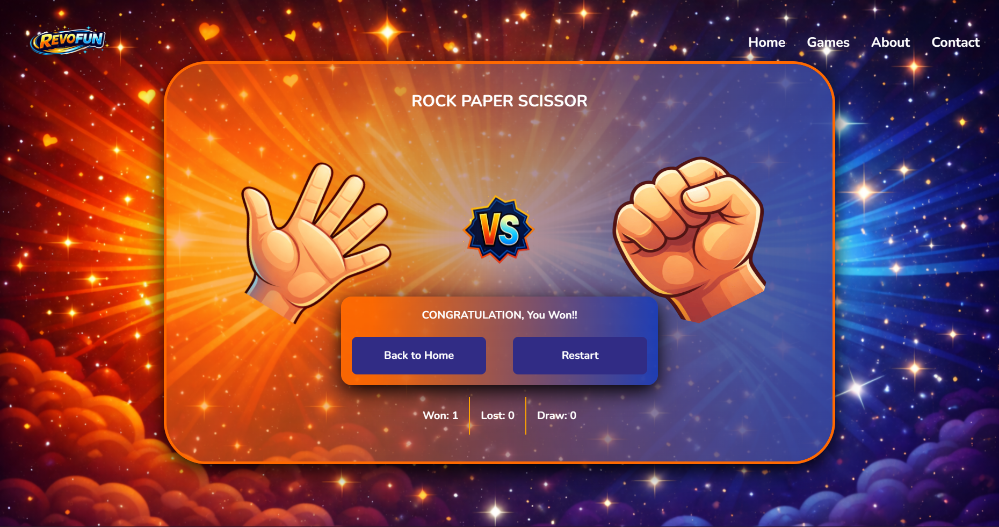

### About Page
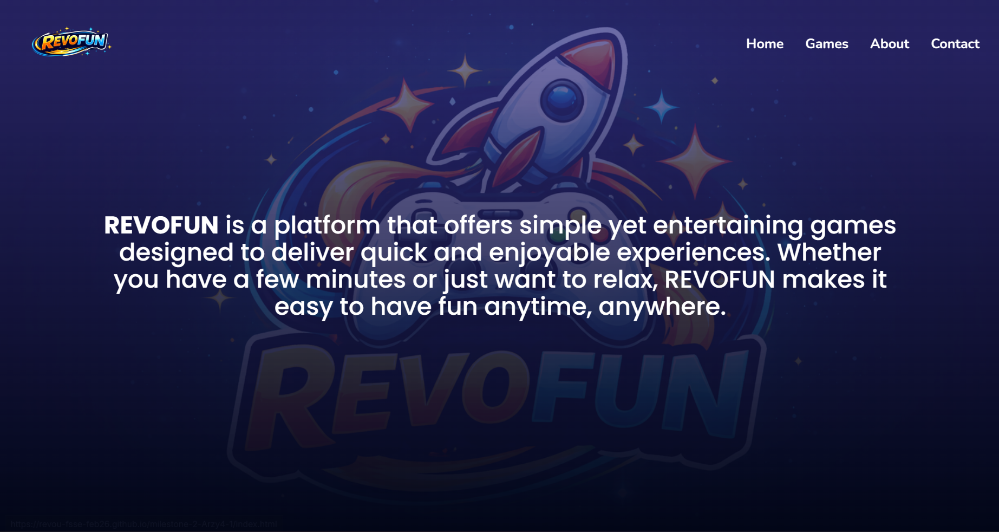
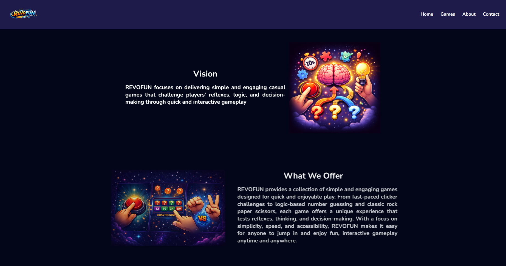

### Contact Page
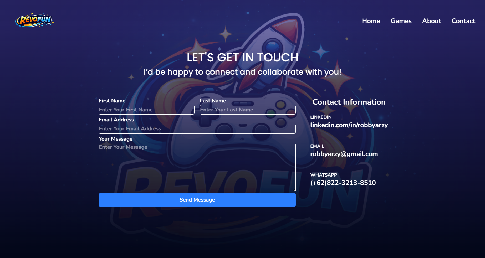